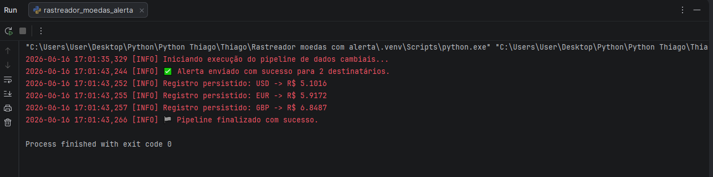

# 💱 Sistema Inteligente de Monitoramento Cambial e Alertas (Python + SQLite)

Este é um projeto focado em resolver um problema crítico de **Supply Chain, Importação e Logística Internacional**: a volatilidade do câmbio. O robô atua coletando, estruturando e armazenando dados financeiros, aplicando inteligência de negócio para disparar alertas automatizados em formato HTML para múltiplos tomadores de decisão quando há oscilações severas no mercado.

## 🚀 Funcionalidades e Regras de Negócio

- **Extração Automatizada (API):** Consome dados em tempo real da AwesomeAPI coletando as cotações do Dólar (USD), Euro (EUR) e Libra (GBP).
- **Armazenamento Histórico (Data Warehouse Local):** Os dados são persistidos de forma estruturada em um banco de dados local SQLite, criando um histórico proprietário pronto para análises futuras e integração com Power BI.
- **Análise de Tendência Cambial:** O robô compara a cotação atual com o último registro salvo no banco e calcula a variação percentual.
- **Sistema de Alerta Multi-Destinatários:** Envia e-mails formatados em HTML via protocolo SMTP (TLS) para uma lista parametrizável de e-mails caso:
  - A variação percentual de qualquer moeda seja superior a **0.1%** (Alerta de Volatilidade).
  - O valor do Dólar ultrapasse um teto crítico pré-definido (Ex: **R$ 5,05**).
- **Ambiente Seguro:** Utiliza variáveis de ambiente em um arquivo oculto `.env` para proteção de credenciais e senhas críticas, adotando boas práticas de segurança corporativa.
- **Rastreabilidade:** Logs estruturados salvos localmente em arquivos `.log` para auditoria contínua do pipeline.

## 🛠️ Tecnologias Utilizadas

- **Python 3.x**
- **SQLite3** (Persistência e queries parametrizadas)
- **Requests** (Consumo de APIs REST e tratamento HTTP)
- **Smtplib & Email MIME** (Protocolo de transporte de e-mail e estruturação HTML)
- **Python-dotenv** (Gerenciamento seguro de credenciais)
- **Logging** (Rastreabilidade e diagnóstico de falhas)

## 📁 Prints do Projeto




## 📁 Estrutura do Projeto

```text
├── main.py                # Arquivo principal do script e pipeline
├── .env                   # Arquivo oculto com as credenciais de e-mail (Não enviado ao Git)
├── cotacoes.db            # Banco de dados local gerado dinamicamente
├── pipeline_cambio.log    # Arquivo de texto gerado com o histórico de logs do robô
└── README.md              # Documentação do projeto